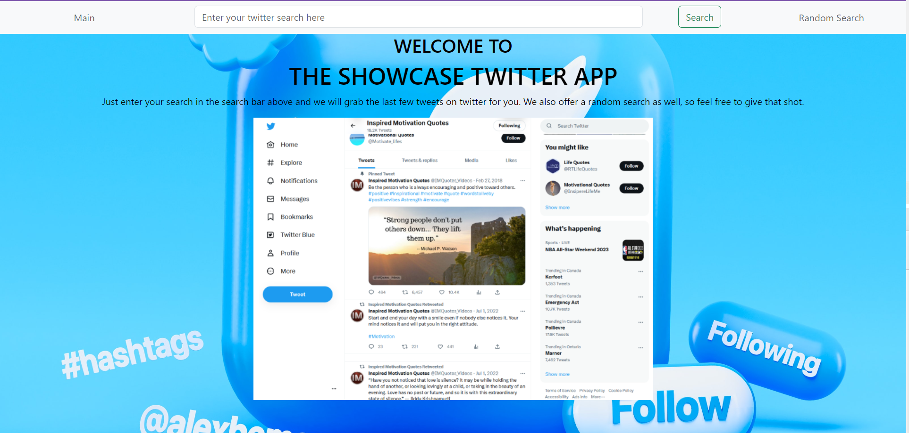

# **Twitter Showcase APP**

*Grabbing Tweets from Twitter written in Javascript, HTML, CSS, and Python*

You can run the program from [here](https://twitter-showcase-app-ucxm.onrender.com).
  

## **Summary**

This is my very first time programming in two languages!!  The last project was the Star Wars API
where everything was done on the front end.  This project gave me the opportunity to program the
front end and the back end.

What I learned from this project was how the backend and frontend work together to make the app
work.  Many programs in today’s world have separated the two in order to make upgrading and managing
the system much easier.

This program was also my continued practice in working with APIs,  APIs as you know are very
important in working on the web as the web is the glue that holds are world together.  It is through
the web that we can remove fear and promote peace in our world.

Philosophy aside, I have also learned about being able to break down the project into small components
and get each one working.  For example in React, I was able to make the Navbar a separate item, and
when displaying content I created a separate component for that.  This allows the programming to be modular.  

This modular approach helped because having two separate pages with the search bar inside the navigation bar
was a challenge, as many of the Main page components had to be copied for use on the Random Search page.  
The modular approach allowed me to minimize the need for copying code.  Furthermore, using two separate pages
with the search bar in the middle created a level of complexity I had not anticipated.  This required me to
use react-router to make it work.

Unfortunately this prolonged the development of my project by quite a bit as a result, but I think you’ll
agree that the final result was worth it!

#### **Author**

Asher Green - *Full Stack Developer* \
[website](http://ashergreen.ca) | [LinkedIn](https://www.linkedin.com/in/asher-green-6a96551/)
